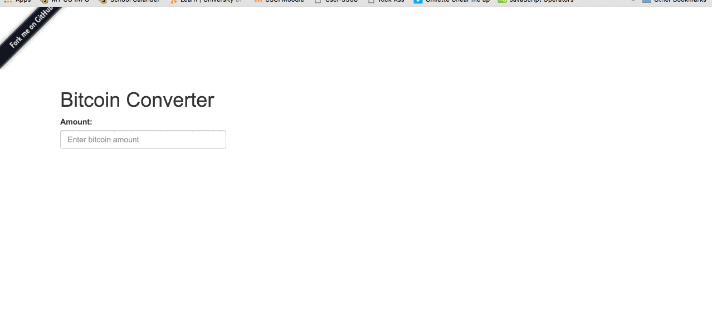

 

	
	 
	
	 
	 
	Realtime Bitcoin Conversion Website.
	 

	
	 
	 

## Website
You can visit the website by clicking [here](https://bitcoin-converter.herokuapp.com/)
## Why
Bitcoin prices are constantly changing. Having a simple site that does basic conversions makes it simplier than trying to search conversion rates. With cryptocurrency on the rise, a basic website with fast conversions is ideal.
## Future Plans
Currently it only converts bitcoin to USD. I want to impliment a dropdown box next to the input box to convert to EUR, YEN, ect. 

 

